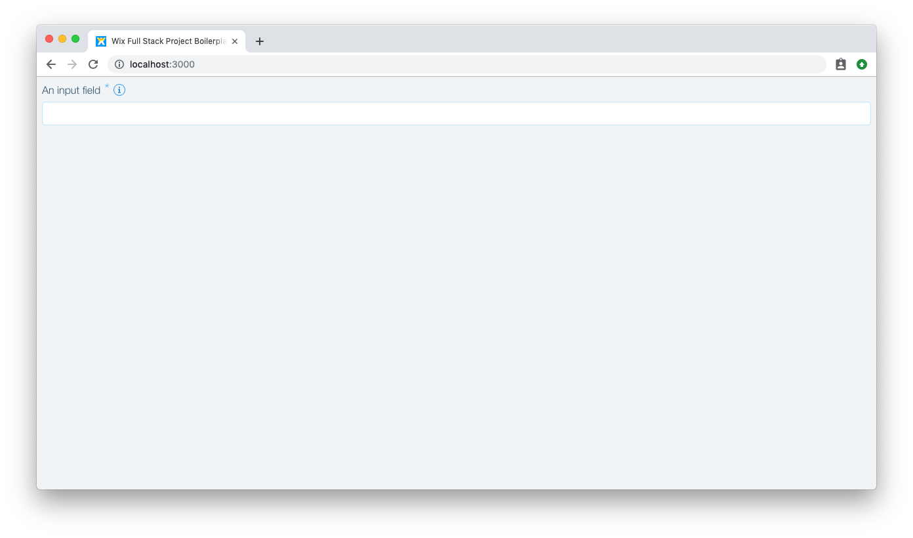
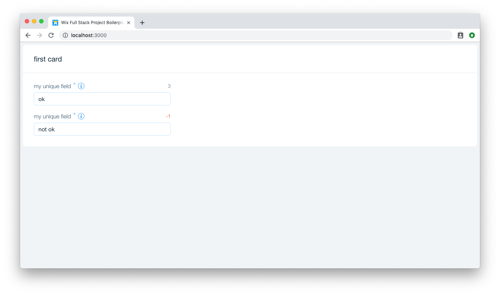

# FormField

`FormField` is a common utility to display information about the desired form element.

## Component
```js
import FormField from 'wix-style-react/FormField';
```

The component is a wrapper over any element passed as a children.
It can take optional `label`, display a `required` indication and `infoContent` tooltip.


## API
Follow the API section to understand what other props the components takes:

[FormField documentation](https://wix-wix-style-react.surge.sh/?selectedKind=Components&selectedStory=FormField&full=0&addons=0&stories=1&panelRight=0)

## Usage

In the following example, we will display a simple `FormField` usage with an `Input`:

```jsx
import React from 'react';
import FormField from 'wix-style-react/FormField';
import Input from 'wix-style-react/Input';

export default () => (
  <FormField
    label="An input field"
    required
    infoContent="Help me fill the field"
  >
    <Input />
  </FormField>
);
```



## Exercises
1. Create a `Card` with one `Row` and one `Col` that spreads to 6 columns.
2. Inside the Card, add the `FormField` with a label and wrap an `Input`.
3. The `FormField` should display a character counter that indicates only 5 characters are valid for this input (use `charCount` prop)




## What's next

In the next sections, we will get to know useful form components

Next step - [Inputs and Selection](./InputsAndSelection.md).
