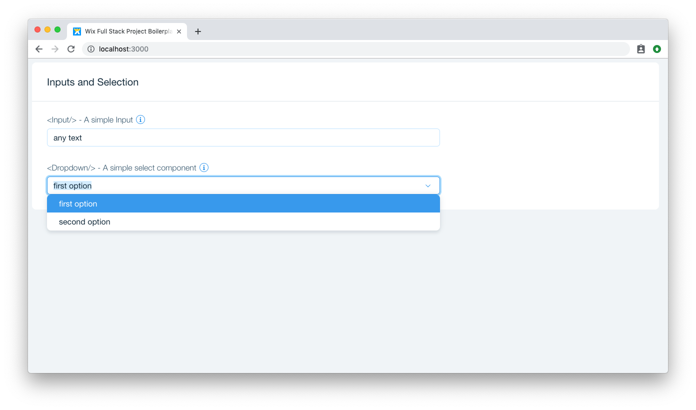

# Inputs and Selection

As seen before `<Input/>` is a common way to consume textual values. In many cases we would like to pick from a list of data, for that case the `<Dropdown/>` component from the selection family is useful

## Components
```js
import Input from 'wix-style-react/Input';
import Dropdown from 'wix-style-react/Dropdown';

```

## Usage

In the following example, we will two common examples of using `Input` and `Dropdown`:

```jsx
import React from 'react';
import { Container, Row, Col } from 'wix-style-react/Grid';
import Card from 'wix-style-react/Card';
import FormField from 'wix-style-react/FormField';
import Input from 'wix-style-react/Input';
import Dropdown from 'wix-style-react/Dropdown';

export default class extends React.Component {
  state = {
    inputValue: '',
    dropdownSelectedId: -1,
  };
  render() {
    return (
      <Container>
        <Row>
          <Col>
            <Card>
              <Card.Header title="Inputs and Selection" />
              <Card.Content>
                <Container fluid>
                  <Row>
                    <Col span={8}>
                      <FormField
                        label="<Input/> - A simple Input"
                        infoContent="Use this for regular text input"
                      >
                        <Input
                          value={this.state.inputValue}
                          onChange={e =>
                            this.setState({ inputValue: e.target.value })
                          }
                        />
                      </FormField>
                    </Col>
                  </Row>
                  <Row>
                    <Col span={8}>
                      <FormField
                        label="<Dropdown/> - A simple select component"
                        infoContent="Use this to pick a value from a set"
                      >
                        <Dropdown
                          selectedId={this.state.dropdownSelectedId}
                          onSelect={option =>
                            this.setState({ dropdownSelectedId: option.id })
                          }
                          options={[
                            {
                              id: 0,
                              value: 'first option',
                            },
                            {
                              id: 1,
                              value: 'second option',
                            },
                          ]}
                        />
                      </FormField>
                    </Col>
                  </Row>
                </Container>
              </Card.Content>
            </Card>
          </Col>
        </Row>
      </Container>
    );
  }
}
```




### Controlled and Uncontrolled components
Notice that in this example, the `Input` component receives also the `value` prop, this causes the component to act as a `controlled` component, make sure you understand the difference between `controlled` and `uncontrolled` components. [Read more here](https://reactjs.org/docs/forms.html).

## API
Follow the API section to understand what other props the components takes:

[Text Input documentation](https://wix-wix-style-react.surge.sh/?selectedKind=Components&selectedStory=Input&full=0&addons=0&stories=1&panelRight=0)

[Dropdown documentation](https://wix-wix-style-react.surge.sh/?selectedKind=Components&selectedStory=Dropdown&full=0&addons=0&stories=1&panelRight=0)

## Exercises
1. Make `Input` appear in an error state with some error message.
1. Add another option to the `Dropdown` component and make sure it is selectable.

## What's next

Chill...
