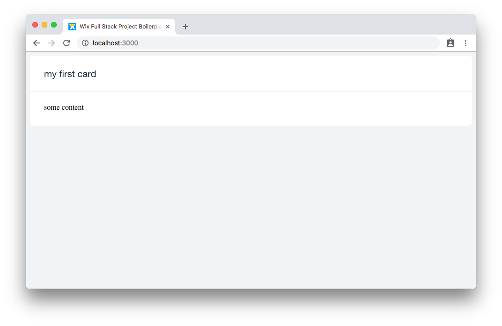
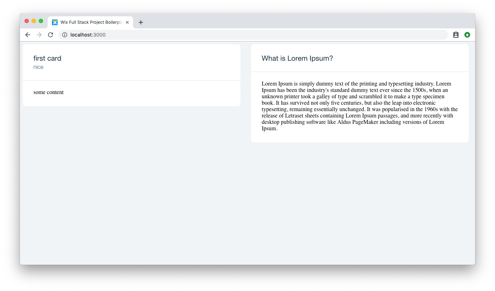
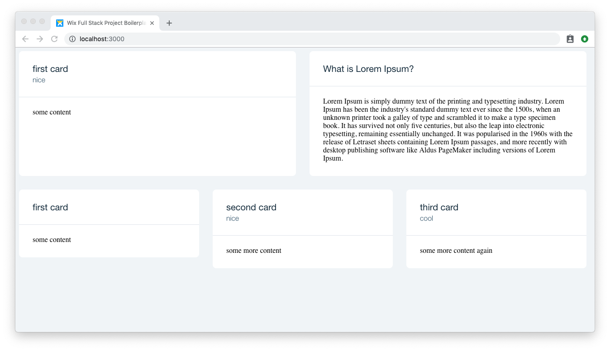
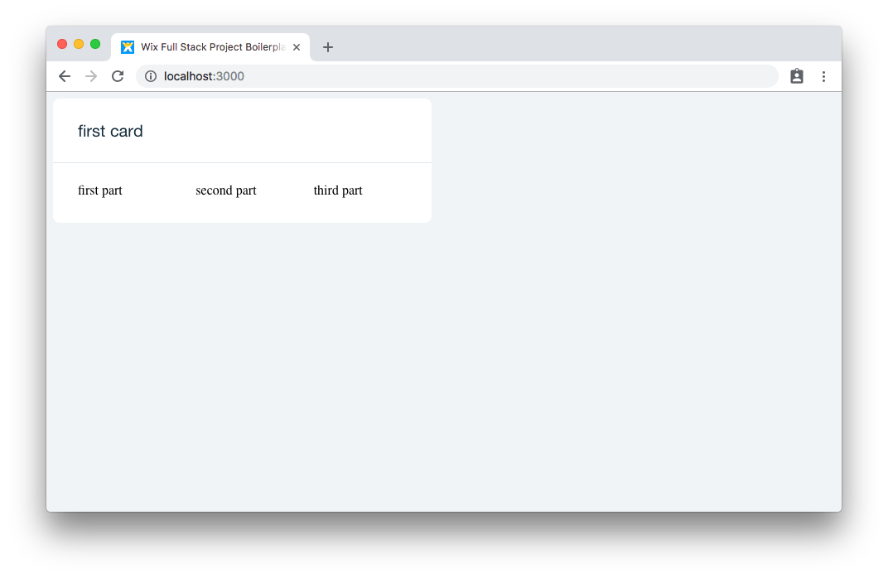

# Card

## Components
The `Card` component is a simple composable white background pane, which contain several extension slots. It is a common way to describe different sections in your app, contain form components and much more.

```js
import Card from 'wix-style-react/Card';
```

1. `Card` - The main component. 

2. `Card.Header` - The top header of a component. It takes `title` prop to display some description about the content.

3. `Card.Subheader` - an in-card header title. It takes `title` prop to display some description about the content.

4. `Card.Content` - This is where all content should go as `children`.

## API
Follow the API section to understand what other props the components takes:
[Card documentation](https://wix-wix-style-react.surge.sh/?selectedKind=2.%20Layout&selectedStory=2.2%20Card%20Layout&full=0&addons=0&stories=1&panelRight=0)

## Usage

In the following example, we will add a card with some content:

```jsx
import React from 'react';
import Card from 'wix-style-react/Card';

export default () => (
  <Card>
    <Card.Header title="my first card" />
    <Card.Content>some content</Card.Content>
  </Card>
);
```



## Cards inside a grid
Cards play well with grid, we will usually place cards inside grid components
```jsx
import React from 'react';
import { Container, Row, Col } from 'wix-style-react/Grid';
import Card from 'wix-style-react/Card';

export default () => (
  <Container>
    <Row>
      <Col span={6}>
        <Card>
          <Card.Header title="first card" subtitle="nice" />
          <Card.Content>some content</Card.Content>
        </Card>
      </Col>
      <Col span={6}>
        <Card>
          <Card.Header title="What is Lorem Ipsum?" />
          <Card.Content>
            Lorem Ipsum is simply dummy text of the printing and typesetting
            industry. Lorem Ipsum has been the industry's standard dummy text
            ever since the 1500s, when an unknown printer took a galley of type
            and scrambled it to make a type specimen book. It has survived not
            only five centuries, but also the leap into electronic typesetting,
            remaining essentially unchanged. It was popularised in the 1960s
            with the release of Letraset sheets containing Lorem Ipsum passages,
            and more recently with desktop publishing software like Aldus
            PageMaker including versions of Lorem Ipsum.
          </Card.Content>
        </Card>
      </Col>
    </Row>
  </Container>
);

```



## Exercises
1. Create another grid row with three equaly spaced cards.
1. Make the first card in the first row to stretch vertically to be the same size as the second one (should use both `Card` and `Row` properties). Search for it in the  [Grid docs](https://wix-wix-style-react.surge.sh/?selectedKind=Components&selectedStory=Grid&full=0&addons=0&stories=1&panelRight=0) under "equal height".



## Grid inside a card
As you might have noticed in the previous section, Grid components can be used for internal parts. Card is an exellent example for another content container.
In this case, `Container` is not needed, only `Col` and `Row`.

### Example
```js
import React from 'react';
import { Container, Row, Col } from 'wix-style-react/Grid';
import Card from 'wix-style-react/Card';

export default () => (
  <Container>
    <Row>
      <Col span={6}>
        <Card>
          <Card.Header title="first card" />
          <Card.Content>
            <Row>
              <Col span={4}>first part</Col>
              <Col span={4}>second part</Col>
              <Col span={4}>third part</Col>
            </Row>
          </Card.Content>
        </Card>
      </Col>
    </Row>
  </Container>
);
```



## What's next?
Congratulations, now you know how the design system layout works and you can start creating your own content and form controls.

Next step - [Forms](../Forms/Forms.md).
