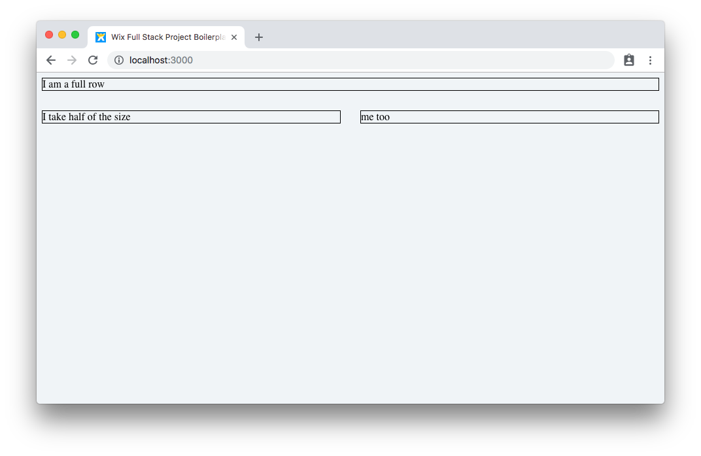
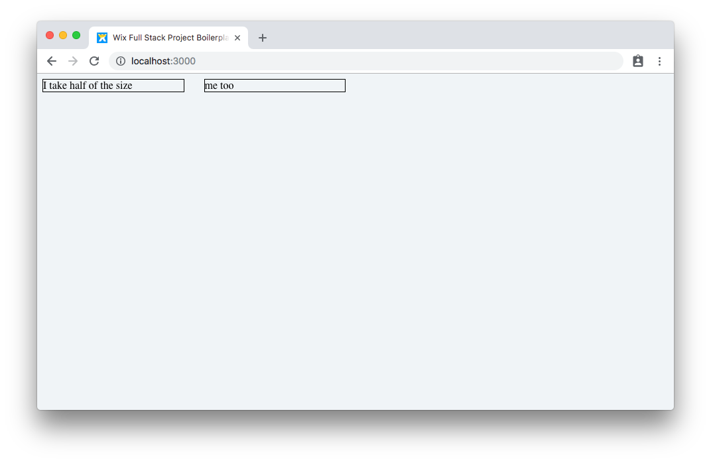

# Grid

## Components
The `Grid` is composed out of three components.

```jsx
import {Container, Row, Col} from 'wix-style-react/Grid';
```

1. `Container` - a wrapper for the main area of the application. Should be used once to apply the minimum width (966px) and maximum width (1284px) of our app content.

2. `Row` - creates a row to contain multiple items. Each row can contain `Col`s

3. `Col` - creates a single column inside a row. A col can take `span` property with values 2, 4, 6, 8, 10, 12. The sum of columns in a rows must be 12 maximum. The default column value is 12.

## API
Follow the API section to understand what other props the components takes:
[Grid documentation](https://wix-wix-style-react.surge.sh/?selectedKind=Components&selectedStory=Grid&full=0&addons=0&stories=1&panelRight=0)

## Usage
In the following example, we will create a Grid containing two rows. The first one will spread for the entire row, while the second will split into two equal parts:

```jsx
import React from 'react';
import { Container, Row, Col } from 'wix-style-react/Grid';

export default () => (
  <Container>
    <Row>
      <Col>I am a full row</Col>
    </Row>
    <Row>
      <Col span={6}>I take half of the size</Col>
      <Col span={6}>me too</Col>
    </Row>
  </Container>
);
```

### Visual Tips
1. Wrap the text nodes with `<div style={{border: '1px solid black'}}>some content</div>` for example to see the borders more clearly
2. As an alternative, you can use the [`<Box/>` component](https://wix-wix-style-react.surge.sh/?selectedKind=Components&selectedStory=Box&full=0&addons=0&stories=1&panelRight=0) for easy CSS manipulations:
```jsx
//import
import Box from 'wix-style-react/Box';
//usage
<Box border="1px solid black">some content</Box>
```



## Exercises
1. Copy the above example to your `App.js` file and see how it looks like.
1. Add a third row that is spread three equal parts.
1. Add a fourth row that spreads into third and two-thirds of the row.

## Nesting
Grid can be nested and contain another division into 12 parts, see the following example:

```jsx
import React from 'react';
import { Container, Row, Col } from 'wix-style-react/Grid';

export default () => (
  <Container>
    <Row>
      <Col span={6}>
        <Row>
          <Col span={6}>I take half of the size</Col>
          <Col span={6}>me too</Col>
        </Row>
      </Col>
    </Row>
  </Container>
);
```



This will lead into an internal division of the first part of the grid into two equal parts of columns.

## What's next

After mastering the grid system, it's time to put some real content inside of it. Up next, you will learn what `Card`s are:

Next step - [Card](./Card.md).
