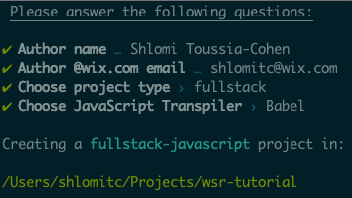
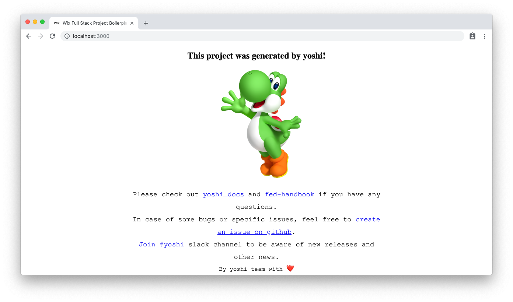

# Bootstrap

## Generating a new working project
The first step will require you to generate a new project.
In Wix, we use [`yoshi`](https://github.com/wix/yoshi) to create and build our applications. `yoshi` is a zero configuration tool that will get you running in no time.

In our example, we will use a newly generated **Fullstack and Babel** project powered by yoshi. Start by following the next commands and generate a project.

```bash
npx create-yoshi-app wsr-tutorial
cd wsr-tutorial
npm start
```



After installation is done, open http://localhost:3000/ to see your app running.



### Working without yoshi (for non-wix projects)
If you wish to use your own build tools, generators or any common tools like [`create-react-app`](https://github.com/facebook/create-react-app), just follow our integration instructions (https://github.com/wix/wix-style-react#build-configuration-prerequisites)

## What's next?

In the next step, we'll start adding `wix-style-react` components.

Next step - [Getting started](./Getting_Started.md)
